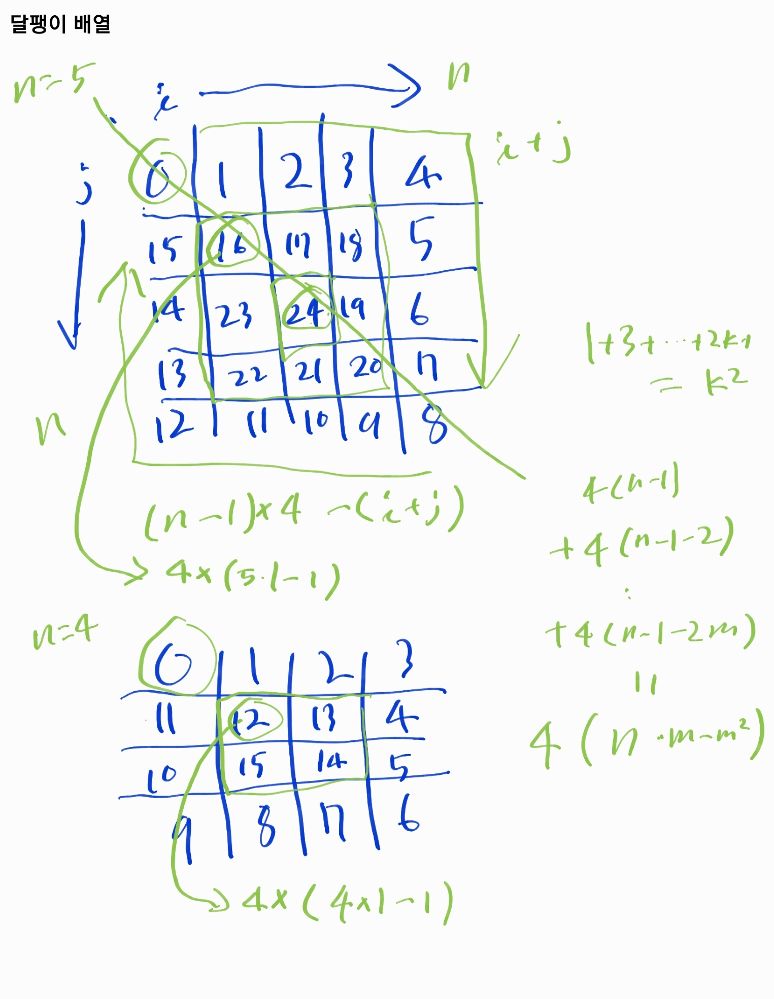

# haskell-spiral-matrix

Implementation of spiral matrix in haskell.

- 달팽이 배열 하스켈 구현

## What is spiral matrix?

ex)

```
input> 5

output>
1 2 3 4 5
16 17 18 19 6
15 24 25 20 7
14 23 22 21 8
13 12 11 10 9
```

## How to make spiral matrix?



- [source code](./src/SpiralMatrix.hs)

output:

```
*Main> spiral 5
[[0,1,2,3,4],[15,20,21,22,5],[14,31,32,23,6],[13,30,29,24,7],[12,11,10,9,8]]
```

## Implementation of main

- [Main.hs](./app/Main.hs)

For better readability, I fixed space between numbers based on maximum value.

```
printList :: (Show a) => Int -> [a] -> IO ()
printList n [] = putStr "\n"
printList n (x:xs) = do
    let len = length (show x)
    putStr $ (show x) ++ (replicate (n - len + 1) ' ')
    printList n xs
```

## Let's build and run it

```
$ git clone https://github.com/hsh814/haskell-small-projects.git
$ cd haskell-spiral-matrix
$ stack build
$ stack exec haskell-spiral-matrix-exe
Input n: 
12
0   1   2   3   4   5   6   7   8   9   10  11  
43  44  45  46  47  48  49  50  51  52  53  12  
42  83  80  81  82  83  84  85  86  87  54  13  
41  82  115 108 109 110 111 112 113 88  55  14  
40  81  114 139 128 129 130 131 114 89  56  15  
39  80  113 138 155 140 141 132 115 90  57  16  
38  79  112 137 154 163 142 133 116 91  58  17  
37  78  111 136 153 152 151 134 117 92  59  18  
36  77  110 135 134 133 132 131 118 93  60  19  
35  76  109 108 107 106 105 104 103 94  61  20  
34  75  74  73  72  71  70  69  68  67  62  21  
33  32  31  30  29  28  27  26  25  24  23  22 
```